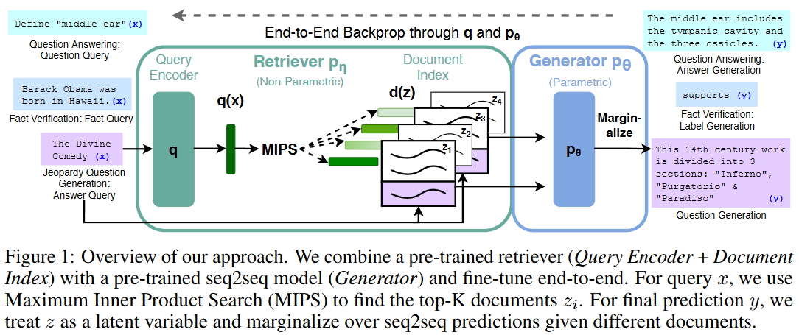
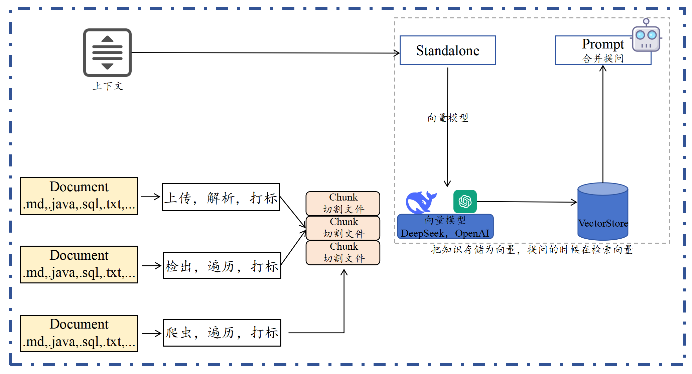
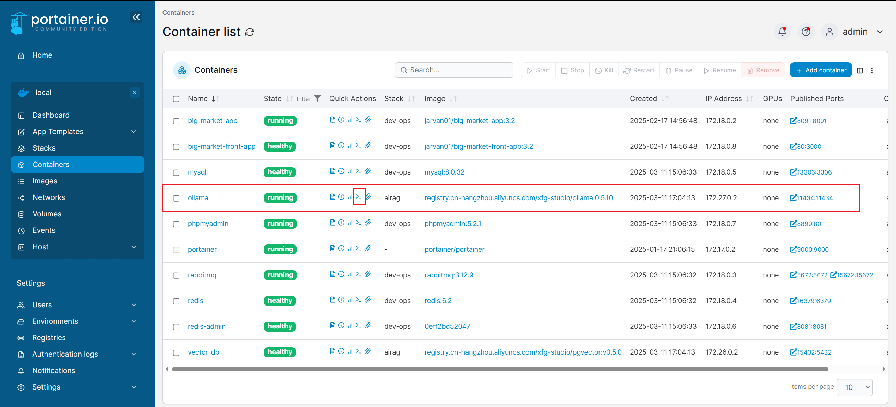
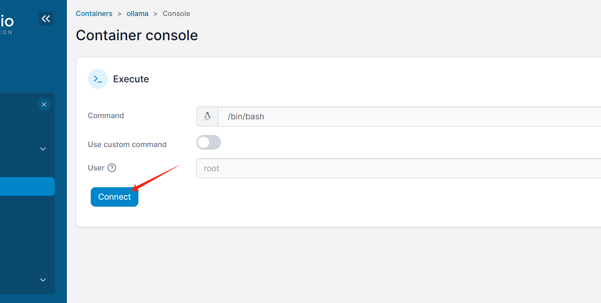
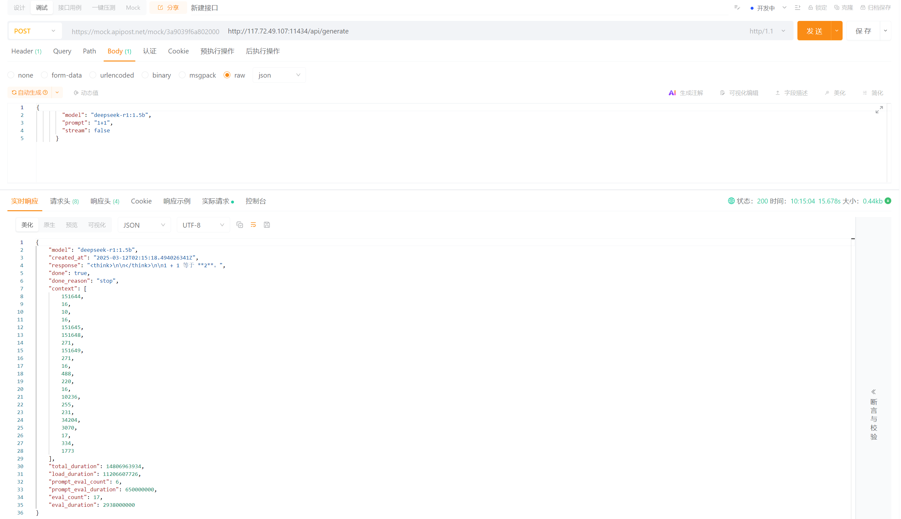

# Ai-Rag：DeepDeek+RAG 增强检索知识库系统

## 前提概述
这是一套基于 Ollama DeepSeek 大模型构建的增强 RAG 知识库检索项目，在这套项目上，
实现了除普通文档知识解析外，增加了 Git 代码库的拉取和解析，并提供操作接口。
为工程师做项目开发时，`需求分析`、`研发设计`、`辅助编码`、`代码评审`、`风险评估`、`上线检测`等，
做工程交付提效。

AI 开发能力，几乎已经是每个工程师必备的能力。在我们去看各个公司招聘要求时，经常会看到具备 AI、AIGC、RAG 能力优先。因为这些东西可以帮助企业提效，结合AI增强自身产品能力。所以，学习一下这样的东西是非常重要的！

在 AI 的使用场景中，我们考虑过；代码评审、需求开发、智能客服、SQL编写、需求分析等。但这些东西的回答，会随着我们发给 AI 的内容来解答，但受到AI对话的上线文字数限制，不太可能把且有的所有资料都一次发给 AI 进行解答。所以这里引出了企业知识库构建的诉求。它就是 RAG！

RAG（检索增强生成）技术正在重构互联网知识规则，RAG不仅仅是一个简单的知识存储工具，它是一种将检索与生成相结合的智能系统，能够从海量数据中快速提取相关信息，并结合上下文生成精准、连贯的答案。对于互联网公司而言，构建自己的RAG知识库，意味着能够为用户提供更加个性化、专业化的服务，同时也能够在激烈的市场竞争中，建立起独特的技术壁垒。

虽然市面有一些开源的 RAG，但深入使用仍不能解决所有的场景问题，尤其是你想自定义业务诉求，解析更多场景，更复杂的知识库时候，它们就显得不合适了。并且研发人员，自身应该具备RAG开发能力。

所以，我们来啦！构建一款属于自己的小型的 RAG 知识库，以此掌握 RAG 相关知识，扩宽自己的技术边界。

## 第一部分：关于 AI RAG 知识库项目介绍

### 项目简述
基于 Ollama 部署 DeepSeek 大模型，提供 API 接口。运用 Spring AI 框架承接接口实现 RAG 知识库能力。这款 RAG 知识库支持文本解析，以及 Git 代码库的解析。

工程结构采取2层架构，轻量化设计，重点在于突出 RAG 功能实现。以此方式，帮助大家更好的理解，除了工程架构外的 RAG 知识库搭建。方便大家快速上手学习。

### 什么是RAG
RAG：检索增强功能

它通用语言模型通过微调就可以完成几类常见任务，比如分析情绪和识别命名实体。这些任务不需要额外的背景知识就可以完成。

要完成更复杂和知识密集型的任务，可以基于语言模型构建一个系统，访问外部知识源来做到。这样的实现与事实更加一性，生成的答案更可靠，还有助于缓解“幻觉”问题。

Meta AI 的研究人员引入了一种叫做检索增强生成（Retrieval Augmented Generation，RAG）的方法来完成这类知识密集型的任务。RAG 把一个信息检索组件和文本生成模型结合在一起。RAG 可以微调，其内部知识的修改方式很高效，不需要对整个模型进行重新训练。

RAG 会接受输入并检索出一组相关/支撑的文档，并给出文档的来源（例如维基百科）。这些文档作为上下文和输入的原始提示词组合，送给文本生成器得到最终的输出。这样 RAG 更加适应事实会随时间变化的情况。这非常有用，因为 LLM 的参数化知识是静态的。RAG 让语言模型不用重新训练就能够获取最新的信息，基于检索生成产生可靠的输出。

Lewis 等人（2021）提出一个通用的 RAG 微调方法。这种方法使用预训练的 seq2seq 作为参数记忆，用维基百科的密集向量索引作为非参数记忆（使通过神经网络预训练的检索器访问）

### 功能流程
我们知道 AI（OpenAI/DeepSeek）的信息回复是基于我们的提问，提问的信息越完善准确，越可以更好的反馈结果。

那么对于一个Git项目或者一个工程的全部SQL，我们需要对工程信息发起提问，但不想每次都从工程或者SQL中做整理，那么就可以把这些信息提交给知识库。那么每次提问的时候选择对应的知识库，就可以帮我们携带文本向量匹配知识，之后进行一起提交给 AI 大模型来提问。如图；

+ 首先，文本知识库可以是非常多种的类型，不非得限定到文字，也可以是sql或者java代码。那么这里我们就可以解析一类是上传的文件，一类是Git代码库的项目。也可以是来自于网页的内容之后爬虫。这些内容都可以被解析处理。

+ 之后，把文件进行切割，存储到向量模型。存储的时候要对文件进行打标，标记出属于哪个知识库。甚至你可以做的更细致，比如，项目工程时，这是什么包下的什么类。都可以打标。完事后存储到向量库。这个也就是说所说的文本向量化。

+ 最后，在进行提问的时候，以提交的问题和问题到向量库检索，一起合并信息进行提问，这样提问的信息描述会更加定向准确，也就可以获得更好的回答。如，我们问的是，请对拼团项目SQL语句，生产对应的所有JavaPO对象。那么这个时候就会反馈类信息了。也可以为运营伙伴提供必要的SQL语句请提供我要查询xxx、yyy、zzz数据，在什么时间产生的数据。，他们也就不用非得找研发要SQL语句了。这样就可以帮助企业提效了。

## 第二部分：初始化知识库工程&提交代码

### 环境安装
#### 1、安装脚本

#### 2、执行安装
使用docker来进行安装（文件路径：docs/dev-ops/docker-compose-environment-aliyun.yml）

>docker-compose -f docker-compose-environment.yml up -d

首先，无论本地还是云服务器，你都可以通过命令进入到 docker-compose-environment.yml 所在文件夹。之后执行 docker-compose -f docker-compose-environment.yml up -d

注意，如果安装过程中比较慢，推荐使用 docker-compose -f docker-compose-environment-aliyun.yml up -d 带有镜像地址方式安装。如果不可用，可以选择配置 Docker 镜像方式安装。

#### 3、Ollama + DeepSeek模型安装

> ollama pull deepseek-r1:1.5b   # 拉取模型

> ollama run deepseek-r1:1.5b    # 运行模型

> ollama pull nomic-embed-text   # 向量文本

### 创建工程

#### 调用接口
